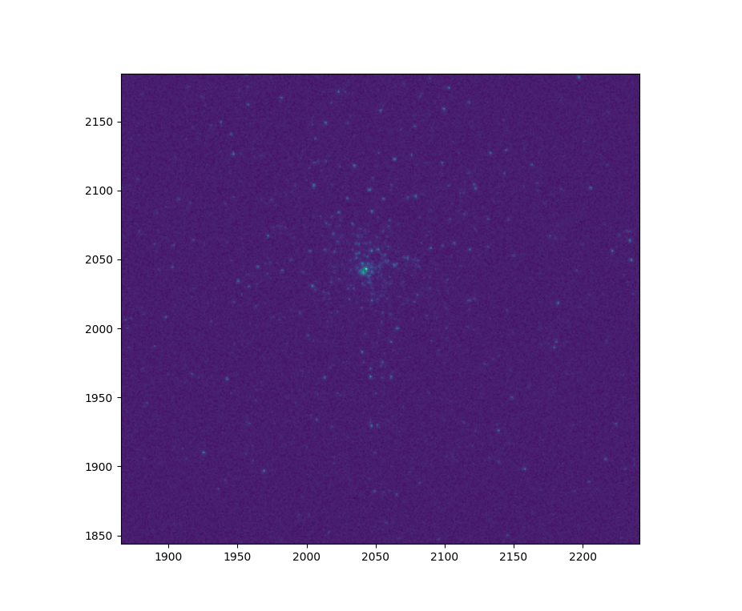

********************
STIPS Basic Tutorial
********************

This page will take you through the process of creating a basic STIPS observation.  You
must have STIPS installed –– if you do not, please see :doc:`installing STIPS <installation>`.

Importing STIPS and Checking the STIPS Environment
--------------------------------------------------

In order to use STIPS, you must have several sets of data files installed
(:doc:`installing STIPS <installation>` contains instructions on how to do this).  In
order to test your STIPS installation, STIPS includes an environment report utility that
shows which version of STIPS you have installed, as well as the versions of the most
important support packages that STIPS uses.  When you run the code below, you should get
an output set of the following form:

.. code-block:: python

  import stips
  print(stips.__env__report__)

.. code-block:: text

    STIPS Version x.y.z with Data Version x.y.z at /Some/Path/To/stips_data

    STIPS Grid Generated with x.y.z

    Pandeia version a.b.c with Data Version a.b.c. at /Some/Path/To/pandeia_refdata

    Webbpsf Version d.e.f with Data Version d.e.f at /Some/Path/To/webbpsf_data_path

Setting Up Some Basics
----------------------

STIPS allows you to set up some basic elements of your observation and pass them when
creating and running observations.  Below is one way to set these up.

.. code-block:: python

  obs_prefix = 'notebook_example'
  obs_ra = 150.0
  obs_dec = -2.5

Creating a Scene to Observe
---------------------------

STIPS contains functions to generate stellar populations as well as background galaxies.
These functions are all present in the ``SceneModule`` class.  In order to know what sort
of populations to generate, the Scene Module requires input dictionaries to specify
population parameters.  In this example, we will create the following:

#. A stellar population representing a global cluster with:

   * 100 stars
   * An age of 7.5 billion years
   * A metallicity of -2.0
   * A Salpeter IMF with alpha = -2.35
   * A binary fraction of 10%
   * A clustered distribution (higher-mass stars closer to the population center)
   * An inverse power-law distribution
   * A radius of 100 parsecs
   * A distance of 10 kpc
   * No offset from the center of the scene being created

#. A collection of background galaxies with:

   * 10 galaxies
   * Redshifts between 0.0 and 0.2
   * Radii between 0.01 and 2.0 arcsec
   * V-band surface brightness magnitudes between 28 and 24
   * Uniform spatial distribution (unclustered) over 200 arcsec
   * No offset from the center of the scene being created

.. note::

  Background galaxies are available in STIPS, but are neither supported nor tested.

.. code-block:: python

  obs_prefix = 'notebook_example'
  obs_ra = 150.0
  obs_dec = -2.5

  from stips.scene_module import SceneModule

  scm = SceneModule(out_prefix=obs_prefix, ra=obs_ra, dec=obs_dec)

  stellar_parameters = {
                        'n_stars': 100,
                        'age_low': 7.5e12,
                        'age_high': 7.5e12,
                        'z_low': -2.0,
                        'z_high': -2.0,
                        'imf': 'salpeter',
                        'alpha': -2.35,
                        'binary_fraction': 0.1,
                        'clustered': True,
                        'distribution': 'invpow',
                        'radius': 100.0,
                        'radius_units': 'pc',
                        'distance_low': 20.0,
                        'distance_high': 20.0,
                        'offset_ra': 0.0,
                        'offset_dec': 0.0
                       }

  stellar_cat_file = scm.CreatePopulation(stellar_parameters)
  print("Stellar population saved to file {}".format(stellar_cat_file))

  galaxy_parameters = {
                       'n_gals': 10,
                       'z_low': 0.0,
                       'z_high': 0.2,
                       'rad_low': 0.01,
                       'rad_high': 2.0,
                       'sb_v_low': 30.0,
                       'sb_v_high': 25.0,
                       'distribution': 'uniform',
                       'clustered': False,
                       'radius': 200.0,
                       'radius_units': 'arcsec',
                       'offset_ra': 0.0,
                       'offset_dec': 0.0,
                      }

  galaxy_cat_file = scm.CreateGalaxies(galaxy_parameters)
  print("Galaxy population saved to file {}".format(galaxy_cat_file))

Creating a STIPS Observation
----------------------------

Once a scene has been created, it's possible to observe that scene as many times as you
wish (and from as many places as you wish, although obviously any observation that doesn't
include at least some of the scene will simply be an empty exposure).  In this case, we
will create a single Roman WFI observation.

STIPS uses a bit of specialized terminology to describe its observations.  In particular:

* An *observation* is a set of exposures with a single instrument (e.g. Roman WFI), one or
  more filters (where each exposure in the observation will be repeated for every included
  filter), and some number of the instrument's detectors (for WFI, between 1 and 18),
  where each exposure will be repeated, with the appropriate inter-detector offset, for
  every included director, a single chosen sky background value, a single exposure time
  (applied to each exposure in the observation), and one or more offsets.

* An *offset* is a single telescope pointing.  For each offset specified in the observation,
  an exposure will be created for each detector and each filter at the offset.  STIPS may,
  optionally, create one or more mosaics at each offset, with a single mosaic including
  all detectors with the same filter.  In addition, STIPS can create a single combined
  mosaic for each filter in the combined Observation.

In this case, we will create an observation with:

  * Roman WFI F129

  * 1 detector

  * No distortion

  * Sky background of 0.15 counts/s/pixel

  * The ID 1

  * An exposure of 1000 seconds

We will use a single offset with:

  * An ID of 1

  * No centering (if an offset is centered, then, for a multi-detector observation, each
    detector is centered on the offset co-coordinates individually rather than the instrument
    as a whole being centered there)

  * No change in RA, DEC, or PA from the center of the observation

We will use the following residual settings:

  * Flatfield residual: off

  * Dark current residual: off

  * Cosmic ray removal residual: off

  * Poisson noise residual: on

  * Readnoise residual: on

.. code-block:: python

  from stips.observation_module import ObservationModule

  offset = {
            'offset_id': 1,
            'offset_centre': False,
            'offset_ra': 0.0,
            'offset_dec': 0.0,
            'offset_pa': 0.0
            }

  residuals = {
               'residual_flat': False,
               'residual_dark': False,
               'residual_cosmic': False,
               'residual_poisson': True,
               'residual_readnoise': True
              }

  observation_parameters = {
                            'instrument': 'WFI',
                            'filters': ['F129'],
                            'detectors': 1,
                            'distortion': False,
                            'background': 0.15,
                            'observations_id': 1,
                            'exptime': 1000,
                            'offsets': [offset]
                            }

  obm = ObservationModule(observation_parameters, out_prefix=obs_prefix, ra=obs_ra, dec=obs_dec, residual=residuals)

Finally, ``nextObservation()`` is called to move between different combinations of offset and
filter.  It must be called once in order to initialize the observation module to the first
observation before adding catalogues.

.. code-block:: python

  obm.nextObservation()

Observing the Created Scene
---------------------------

In order to observe the scene, we must add the scene catalogues created above to it, add
in error residuals, and finalize the observation.  In so doing, we create output catalogues
which are taken from the input catalogues, but only contain the sources visible to the
detectors, and convert source brightness into units of counts/s for the detectors.

.. code-block:: python

  output_stellar_catalogues = obm.addCatalogue(stellar_cat_file)
  output_galaxy_catalogues = obm.addCatalogue(galaxy_cat_file)

  print("Output Catalogues are {} and {}".format(output_stellar_catalogues, output_galaxy_catalogues))

  obm.addError()

  fits_file, mosaic_file, params = obm.finalize(mosaic=False)

  print("Output FITS file is {}".format(fits_file))
  print("Output Mosaic file is {}".format(mosaic_file))
  print("Observation Parameters are {}".format(params))

Showing the Result
------------------

  Fig. 1: Output from running the STIPS basic tutorial code. Detail from detector center.

We use ``matplotlib`` to plot the resulting simulated image.

.. code-block:: python

  import matplotlib
  import matplotlib.pyplot as plt
  from astropy.io import fits
  matplotlib.rcParams['axes.grid'] = False
  matplotlib.rcParams['image.origin'] = 'lower'

  with fits.open(fits_file) as result_file:
    result_data = result_file[1].data

  fig1 = plt.figure()
  im = plt.matshow(result_data)

Alternatively, you can open the final ``.fits`` file in your preferred imaging software.
