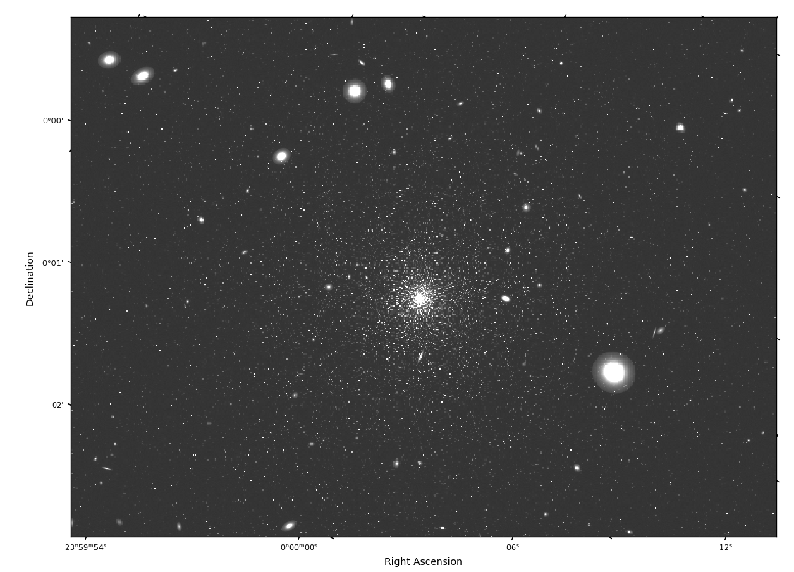

Documentation
=============

Overview
--------
STIPS is the Space Telescope Imaging Product Simulator. It is designed to create simulations of
full-detector post-pipeline astronomical scenes for any telescope. Currently STIPS has modules for
WFC3 IR (F110W and F160W only), JWST (NIRCam Short, NIRCam Long, and MIRI), and WFIRST (WFI). STIPS
has the ability to add instrumental distortion (if available) as well as calibration residuals
(currently flatfield residuals, dark current residuals, and cosmic ray residuals). It automatically
includes Poisson noise and readout noise. It does not include instrument saturation effects. In
addition, STIPS has the ability to generate its own scenes, consisting of stellar populations and
background galaxies (implemented as Sersic profiles).

Why use STIPS?
--------------
STIPS is intended for cases where an ETC (e.g. Pandeia) does not provide enough detector area (e.g.
testing photometry code, quick looks at dither patterns or multi-detector observations of a scene).
For JWST and WFIRST, it obtains its background count levels and instrumental throughput levels from
Pandeia internally, so it should produce output within 10% of output produced by Pandeia.

If extremely good instrumental accuracy is needed, STIPS is not the ideal choice. Instead, the
various instrument design teams have produced much more detailed simulators. STIPS is intended to
run reasonably quickly, and to make scene generation and observation as easy as possible.

Developed by Brian York (`@york-stsci <https://github.com/york-stsci>`_) and
Robel Geda (`@robelgeda <https://github.com/robelgeda>`_).

.. warning::

   STIPS JWST is no longer being actively developed except by inheriting updates to pandeia, webbpsf, and jbt
   (i.e. STIPS will get new throughput information, any changes to the simulated PSFs, and any changes to the
   simulated backgrounds). We do not test the JWST and HST portions of STIPS.

  Fig. 1: Simulated WFI image of a star cluster and background galaxies.

.. toctree::
  :maxdepth: 2

  installation
  examples
